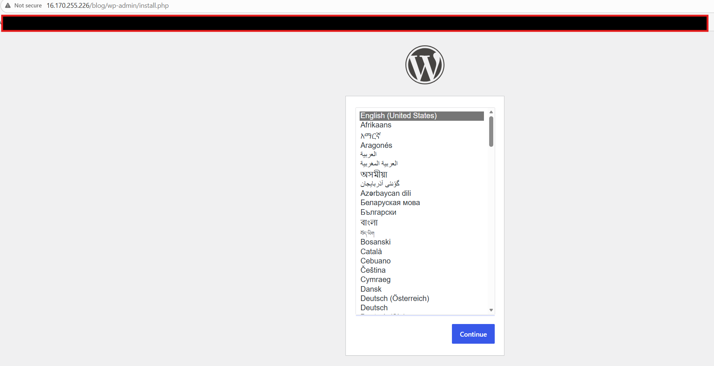
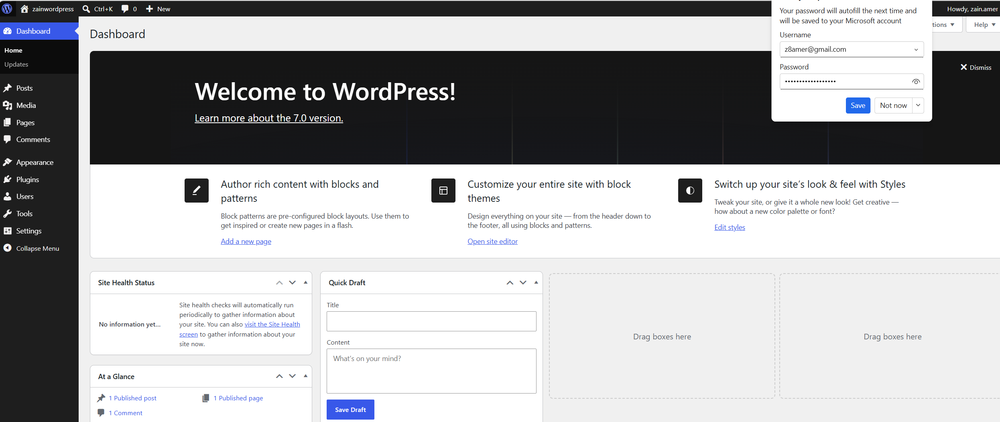

# Deploy WordPress Using Terraform

## 📌 Objective
Use Terraform to provision a full WordPress stack on AWS, including:
- EC2 instance running WordPress
- Security groups (HTTP, SSH, outbound)
- User data / cloud-init to install dependencies
- A working public endpoint
- All resources defined in Terraform

## 🏗️ Architecture
- **AWS Region**: `eu-north-1` (Stockholm)
- **Instance type**: `t3.micro`
- **AMI**: Ubuntu 24.04 LTS (Canonical – owner ID `099720109477`)
- **Web server**: Apache2
- **Database**: MariaDB (on the same EC2 instance)
- **WordPress**: Latest version downloaded from wordpress.org
- **Installation path**: `/var/www/html/blog/` (accessible at `http://<ip>/blog/`)

## 📁 Project Structure  
Terraform/  
├── wordpress/ # All Terraform configuration files  
│ ├── main.tf # Core infrastructure (provider, SG, EC2)  
│ ├── variables.tf # Input variables (instance type, key name, etc.)  
│ ├── outputs.tf # Exported values (public IP, WordPress URL)  
│ ├── user_data.sh # Bash script to install WordPress  
│ ├── providers.tf # Terraform and AWS provider requirements  
│ └── README.md # This file 
└── screenshotfolder/ # Screenshots for the assignment  
├── Terraform-apply.png  
├── Wordpress-Install.png  
├── Wordpress.png  
└── zainwordpress.png  

## 🚀 How to Deploy

### Prerequisites
- AWS account with credentials configured. IAM role with `AmazonEC2FullAccess` permissions.
- Terraform installed (>= 1.0)
- An EC2 key pair in AWS (create one if you don't have it). Update `variables.tf` with your key name.
- The security group includes an SSH rule restricted to 82.34.130.113/32 (mine). To SSH into the instance, replace the IP with your own (in `variables.tf`) and use your own key pair.

### Deployment Steps

1. **Clone or download this repository**  
   ```bash
   git clone <your-repo-url>
   cd terraform-wordpress
   ```

2. **Initialise Terraform**
    ```bash
    terraform init
    ```
3. **Preview the resources**
    ```bash
    terraform plan
    ```
4. **Apply the configuration**
    ```bash
    terraform apply   
    ```
Wait 3‑5 minutes for the user data script to complete (Apache, MariaDB, WordPress download, configuration).

5. **Enter the IP address shown in output**  
    Open a web browser and go to:
    `http://<public-ip>/blog/`
    You should see the WordPress setup screen. Follow the prompts (choose language, create admin user, etc.).

### Challenges & Lessons Learned  
While building this solution, I encountered several problems that taught me important lessons about Terraform and cloud automation.

1. **AMI selection & OS mismatch**  
`Problem:` My first user‑data script was written for Amazon Linux (using yum, amazon-linux-extras, httpd), but the AMI I was launching was actually Ubuntu. This caused apt: command not found and Unit apache2.service could not be found errors.  
`Lesson:` Always use explicit filters (owners, name pattern, architecture) when fetching AMIs. The SSM Parameter Store provides an even cleaner, more reliable alternative. Also, force‑replace instances (terraform taint or -replace) after changing user data.

2. **User data not executing after script updates**  
`Problem:` I updated user_data.sh multiple times, but the Apache test page kept appearing – the script was not running.
Terraform does not automatically replace an EC2 instance when only the content of a referenced file changes. The instance continued using the old user data.  
`Lesson:` After any change to user_data.sh, you must force a replacement using terraform apply -replace="aws_instance.ec2_wordpress". Also, verify that the script is actually being passed by checking /var/log/cloud-init-output.log or the AWS console’s system log.


## 🔧 Important Fixes Applied in user_data.sh  
Used variables throughout consistently for dynamic configuration.

Set correct ownership (www-data:www-data) for Ubuntu.

Enabled and started mariadb and apache2 services.

## Screenshots



