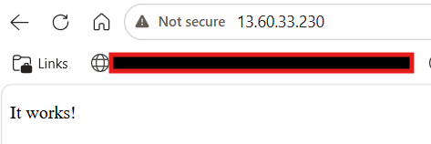

# Terraform EC2 Deployment & Web Server Automation with Cloud-Init

This project automates the deployment of an Amazon EC2 instance running Apache (httpd) using **Terraform** for infrastructure provisioning and **cloud-init** for post-boot configuration.

## Overview

Deploy a web server on AWS EC2 with:
- Apache (httpd) installed and started automatically
- Security group allowing HTTP (port 80) from anywhere
- `key_name` (Key Pair) can be customised (via variable)
- Fully automated - no manual SSH or console steps

## How Terraform uses 'user_data'

In Terraform's 'aws_instance' resource, the **`user_data`** arguement allows you to pass a script or a configuration file that runs **the first time the EC2 instance boots**. Cloud-init (pre-installed on most official AMIs) executes the user_data argument.

In this project we pass the `cloud-init.yaml` file. Cloud-init recognises the #cloud-config header and processes the file.

## Deployment

### Prerequisites 
- AWS account with credentials configured
- Terraform installed (>= 1.0)
- An existing EC2 Key Pair

## Screenshots

